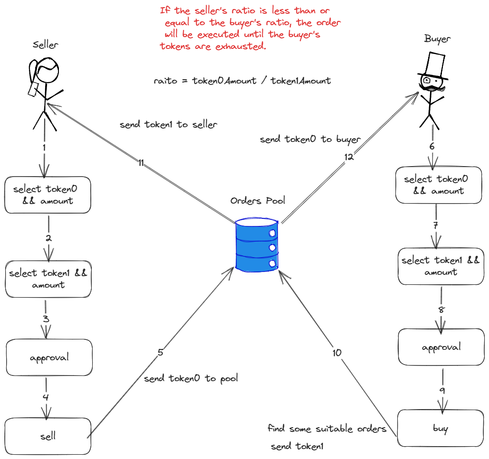

# Hi Jarvis

## Links

- youtube:<https://youtu.be/pnoiDSLyO6k>
- website:

## Overview

We utilize OpenAI's API to transform users' actual needs into formatted data information. For instance, if a user wishes to create an abstraction account, we set up the AI to request information for 3 owner addresses, much like a human would. Once the necessary information is obtained, the AI returns the specific function names and parameter values to the frontend page. We then execute the particular tasks by parsing the parameters. Users only need to provide the information and then click to confirm and sign the transaction.

By leveraging the intelligence of OpenAI in conjunction with blockchain protocols, we enable AI to facilitate rapid interactions with the blockchain. This eliminates the need for clicking various buttons, inputting specific amounts, or navigating through different pages. You simply need to instruct Jarvis about the task you wish to perform. In our initial version, we've accomplished the following features:
- 1.create abstraction account
- 2.transfer token from aa
- 3.create custom erc20 token
- 4.mimt erc20 token
- 5.switch metamask network
## Flowchart

## Support Chains

### safeAA
- Base goerli
- Goerli

### ERC20 && swith network
- All chains

## Reference
- [1] OpenAi https://platform.openai.com/docs/introduction
- [2] tailwindcss https://tailwindcss.com/
- [3] dasyUi https://daisyui.com/
- [4] next.js https://nextjs.org/
- [5] ether.js https://docs.ethers.org/v6/
- [6] foundry https://book.getfoundry.sh/forge/writing-tests

## License

SPDX short identifier: MIT
