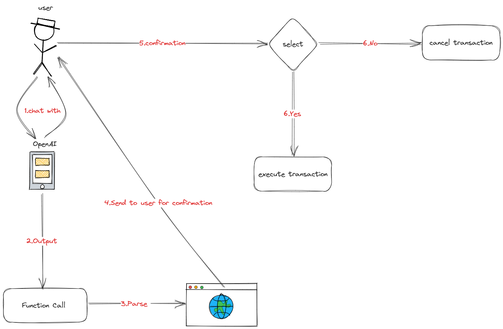

# PeerTradeX

## Links

- USDC:<https://gobi-explorer.horizen.io/address/0xEaB08b7987fAfB772b578236c9CAd4202DD11542>
- WETH:<https://gobi-explorer.horizen.io/address/0xFFA1753833c5643D512eBc1Ace2c96AAf3861bdC>
- contract:<https://gobi-explorer.horizen.io/address/0x9B31226C46659FC1B85602abbC0204BeCf8c16AD>
- youtube:
- website:

## Overview

### Summary

PeerTradeX is an Automated Trades platform where buyers can choose supported ERC20 tokens and their desired target tokens for exchange. They can also select their preferred exchange rates through the user interface (UI). Once the interaction is completed on the UI, the buyers can deposit their ERC20 tokens into the smart contract. Similarly, sellers can perform similar actions by selecting exchange rates that they find suitable. We will then search for orders in the contract pool that match the desired exchange rates until the specified token quantity from the user is reached. Upon completion of the transaction, the corresponding token quantity will be automatically sent to the seller. All transactions are conducted automatically based on the user's set ratio and the smart contract.

### Flowchart



### Code Snippet

#### Sell

```solidity
        //caculate current offer raito
        uint256 raito = initiatorAmount.mul(baseRaito).div(counterPartyAmount);

        //instanceId++
        instanceId.increment();

        //Instance struct.
        Instance memory instance = Instance({
            id: instanceId.current(),
            initiator: msg.sender,
            initiatorERC20: initiatorERC20,
            initiatorAmount: initiatorAmount,
            counterPartyERC20: counterPartyERC20,
            counterPartyAmount: counterPartyAmount,
            raito: raito,
            state: State.BEGUN
        });

        //update orderBook list.
        instances.push(instance);

        //update user order list.
        userOrder[msg.sender].push(instance);
```

#### Buy

```solidity
   //loop the whole initiatorInstances to get a suitable order.
        for (uint256 i = 0; i < instances.length; ) {
            Instance storage instance = instances[i];

            //if raito is suitable then make a deal.
            if (
                counterPartyMaxAmount > 0 &&
                instance.raito >= expectRaito &&
                counterPartyMaxAmount >= instance.counterPartyAmount
            ) {
                //transfer token to initiatorERC20 user , the amount he expect.
                IERC20(counterPartyERC20).safeTransfer(
                    instance.initiator,
                    instance.counterPartyAmount
                );

                //transfer initiatorERC20 to buyer.
                IERC20(initiatorERC20).safeTransfer(
                    msg.sender,
                    instance.initiatorAmount
                );

                //reduce
                counterPartyMaxAmount -= instance.counterPartyAmount;

                //delete instances list.
                idsToDelete[index] = instance.id;

                unchecked {
                    ++index;
                }
                //emit transfer info.

                emit BuyEvent(
                    instance.id,
                    msg.sender,
                    instance.initiator,
                    instance.initiatorERC20,
                    instance.initiatorAmount,
                    instance.counterPartyERC20,
                    instance.counterPartyAmount
                );
            }
```

### Deploy Contract

```shell
npm i
cd contract
//deploy faucet tokens.
npx hardhat run scripts/faucet.js --network zen
//deploy main contract using 2 faucet token addresses.
npx hardhat run scripts/swap.js --network zen
```

## Support Chains

- Gobi Testnet

## Document tree

```shell
$ tree -d -L 2 -I 'node_modules'
PeerTradeX
├── cache
├── components     | react components
├── contracts      | hardhat contracts
│   ├── artifacts
│   ├── cache
│   ├── contracts  |conrtacts .sol file
│   ├── scripts
│   ├── src
│   └── test       |foundry test case
├── lib            |foundry libs
│   ├── forge-std
│   └── openzeppelin-contracts
├── out
├── pages          |react pages
│   └── api
├── public         |root
│   └── network
├── services
├── styles         |css
└── utils          |json file.
```

## Test

```shell
cd contract
forge test --match-contract SwapTest -vvv

Compiler run successful (with warnings)

Running 3 tests for contracts/test/Swap.t.sol:SwapTest
[PASS] testGetSwapRang() (gas: 836599)
[PASS] testOfferAndBuy() (gas: 1182303)
[PASS] testTokenNotSupport() (gas: 13202)
Test result: ok. 3 passed; 0 failed; finished in 2.01ms
```

## Reference

- [1] tailwindcss https://tailwindcss.com/
- [2] dasyUi https://daisyui.com/
- [3] next.js https://nextjs.org/
- [4] ether.js https://docs.ethers.org/v6/
- [5] hardhat https://hardhat.org/
- [6] foundry https://book.getfoundry.sh/forge/writing-tests

## License

SPDX short identifier: MIT
